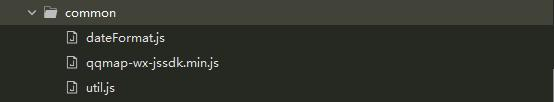
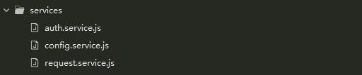
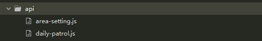
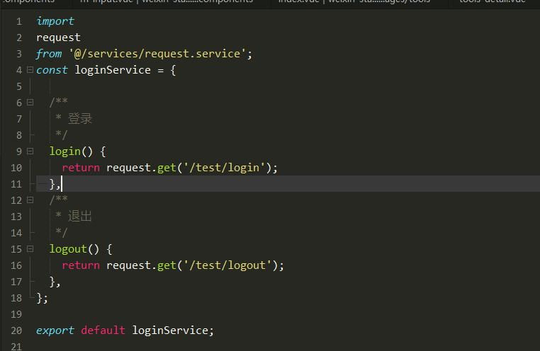

# 微信小程序起步项目

> ## 框架

```shell
项目使用uni-app框架，主要开发微信小程序，其他端暂时没有考虑
```

> ## 项目结构介绍

```shell
+-- api -- (页面接口路径)
|   +-- login.js
|   +-- tools.js
+-- colorui -- (color-ui 样式)
+-- common -- (通用的js方法)
+-- components -- (通用的组件)
+-- pages -- (主要页面)
+-- services -- (通用的服务)
|   +-- auth.service.js -- (主要封装了一些保存用户的token方法)
|   +-- config.service.js -- (存放全局通用的变量)
|   +-- request.service.js -- (封装了uni.request的方法)
+-- static -- (静态文件)
+-- unpackage
+-- App.vue
+-- main.js
+-- manifest.json
+-- pages.json
+-- uni.scss
```


> ## css

项目引入colorUi,丰富页面的样式，
特别感谢： [https://github.com/weilanwl/ColorUI](https://github.com/weilanwl/ColorUI)

> ## js



```shell
common 通用的js方法
```

> ## 接口服务



```shell
* auth.service.js 主要封装了一些保存用户的token方法
* config.service.js 存放全局通用的变量
* request.service.js 封装了uni.request的方法
* 
```


```shell
api 文件夹主要存放各页面的接口路径
```



## 注意：

* README.md 文件无意义，只是对项目简单介绍
* README_files 文件无意义，临时存放README.md引入文件

